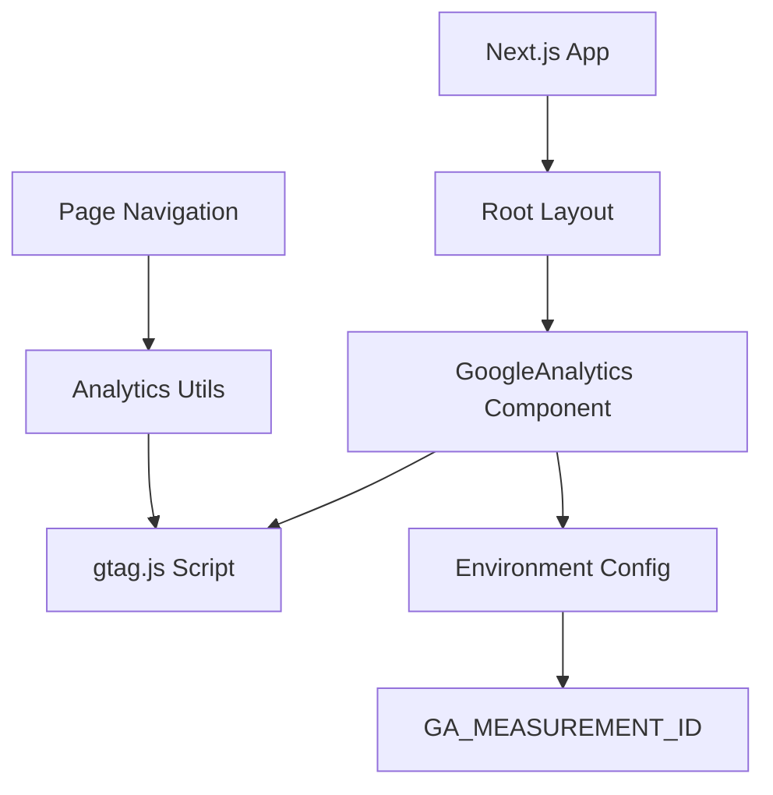

# Design Document

## Overview

This design implements Google Analytics 4 (GA4) integration into the Next.js portfolio application using the gtag.js library. The solution follows Next.js best practices for third-party script loading and ensures optimal performance while providing comprehensive analytics tracking for page views and user interactions.

The implementation will use Next.js's built-in Script component for optimal loading performance and will support environment-based configuration for different deployment scenarios.

## Architecture

The Google Analytics integration will be implemented using a layered approach:

1. **Configuration Layer**: Environment-based configuration management
2. **Analytics Component**: Reusable Google Analytics script component
3. **Integration Layer**: Integration with Next.js app router and layout
4. **Tracking Layer**: Page view and event tracking utilities



## Components and Interfaces

### 1. Environment Configuration

**File**: `.env.local` and `next.config.ts`
- Environment variable `NEXT_PUBLIC_GA_MEASUREMENT_ID` for the tracking ID
- Support for different tracking IDs across environments (development, staging, production)

### 2. GoogleAnalytics Component

**File**: `src/components/GoogleAnalytics.tsx`

```typescript
interface GoogleAnalyticsProps {
  measurementId: string;
}

declare global {
  interface Window {
    gtag: (...args: any[]) => void;
    dataLayer: any[];
  }
}
```

**Responsibilities**:
- Load the gtag.js script asynchronously
- Initialize Google Analytics with the provided measurement ID
- Set up the global gtag function and dataLayer
- Handle script loading errors gracefully

### 3. Analytics Utilities

**File**: `src/lib/analytics.ts`

```typescript
interface PageViewEvent {
  page_title: string;
  page_location: string;
}

interface CustomEvent {
  action: string;
  category: string;
  label?: string;
  value?: number;
}
```

**Functions**:
- `trackPageView(url: string, title: string)`: Track page navigation
- `trackEvent(event: CustomEvent)`: Track custom events
- `isAnalyticsEnabled()`: Check if analytics should be active

### 4. Layout Integration

**File**: `src/app/layout.tsx` (modified)
- Integration of GoogleAnalytics component in the root layout
- Conditional rendering based on environment and measurement ID availability

## Data Models

### Configuration Model
```typescript
interface AnalyticsConfig {
  measurementId: string;
  enabled: boolean;
  debug?: boolean;
}
```

### Event Tracking Model
```typescript
interface TrackingEvent {
  event_name: string;
  event_parameters: {
    page_title?: string;
    page_location?: string;
    custom_parameter?: string;
  };
}
```

## Error Handling

### Script Loading Failures
- Graceful degradation when gtag.js fails to load
- Console warnings in development mode for debugging
- No impact on application functionality if analytics fails

### Configuration Errors
- Validation of measurement ID format
- Fallback behavior when environment variables are missing
- Development mode warnings for configuration issues

### Network Failures
- Timeout handling for script loading
- Retry mechanism not implemented (relies on browser caching)
- Silent failure to prevent application disruption

## Testing Strategy

### Unit Testing
- Test GoogleAnalytics component rendering
- Test analytics utility functions
- Mock gtag function for testing event tracking
- Test environment configuration validation

### Integration Testing
- Test script loading in different environments
- Test page view tracking with Next.js router
- Test component integration with layout

### Manual Testing
- Verify Google Analytics dashboard receives data
- Test page navigation tracking
- Verify script loading performance impact
- Test with ad blockers and privacy tools

### Performance Testing
- Measure script loading impact on page performance
- Test with slow network conditions
- Verify async loading doesn't block rendering

## Implementation Details

### Script Loading Strategy
- Use Next.js Script component with `strategy="afterInteractive"`
- Load gtag.js from Google's CDN asynchronously
- Initialize dataLayer before script loads to prevent data loss

### Environment Configuration
- Use `NEXT_PUBLIC_GA_MEASUREMENT_ID` for client-side access
- Support conditional loading based on environment
- Provide development mode debugging options

### Next.js App Router Integration
- Integrate with app router for automatic page view tracking
- Handle client-side navigation events
- Ensure compatibility with server-side rendering

### Privacy Considerations
- Use standard Google Analytics implementation
- Support for cookie consent integration (future enhancement)
- Respect Do Not Track headers (browser-dependent)

## Security Considerations

- Load scripts only from trusted Google domains
- Use Content Security Policy compatible implementation
- Validate measurement ID format to prevent injection
- No sensitive data transmission through analytics events